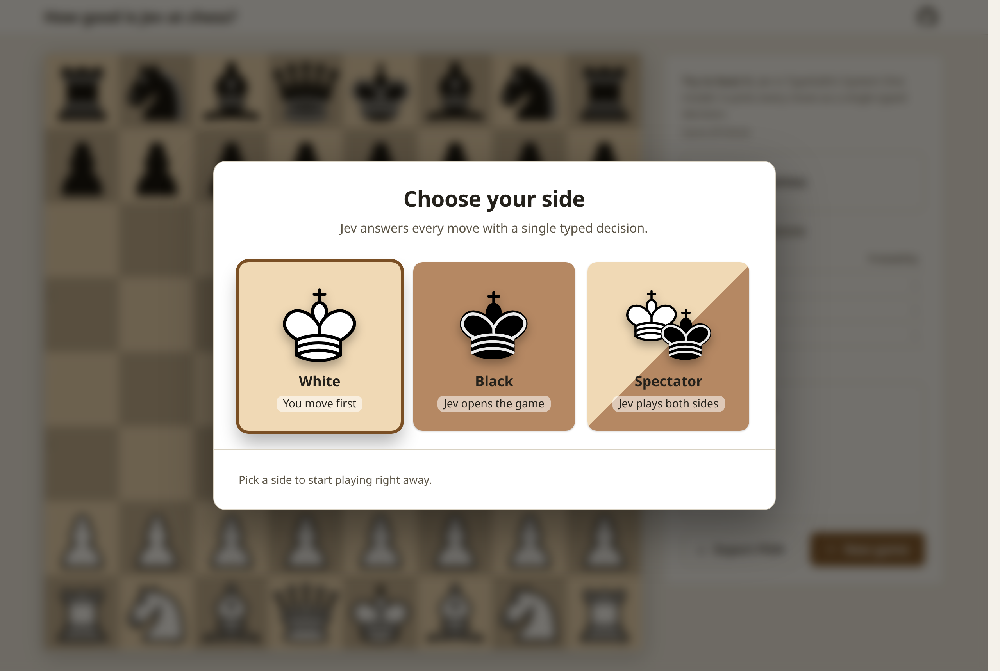
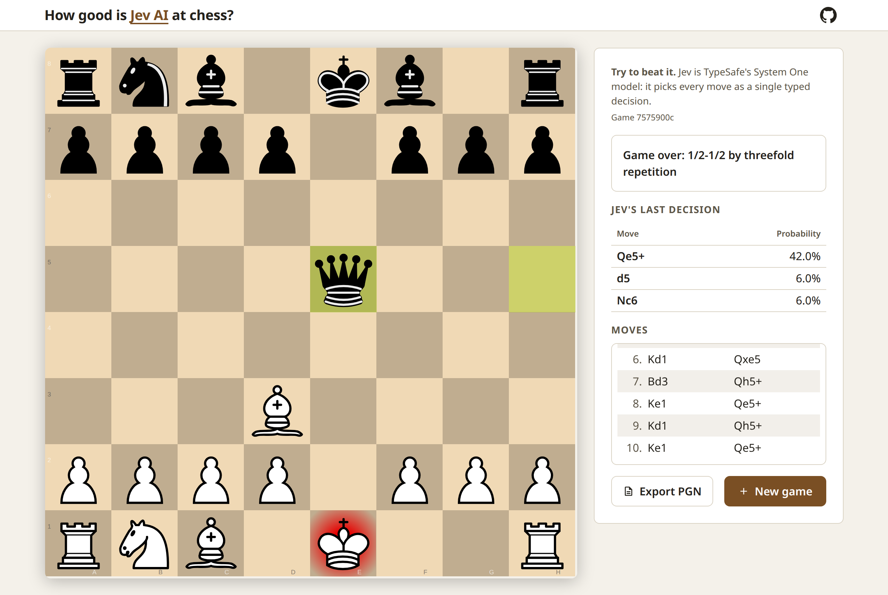
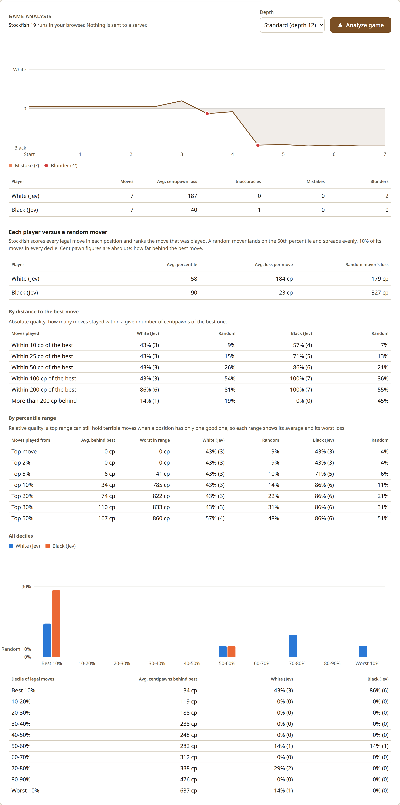

# How good is a [System One model](https://docs.typesafe.ai/concepts/system-one) at chess? ([Jev](https://typesafe.ai), [Laya](https://huggingface.co/convaiinnovations/laya))

`system-one-chess`: play chess in your browser against [Jev](https://typesafe.ai), TypeSafe AI's System One model, called through [Vercel AI Gateway](https://vercel.com/ai-gateway/models/jev) or [OpenRouter](https://openrouter.ai/typesafe).

Jev does not generate text. It answers typed questions about a state with calibrated probabilities. That maps cleanly onto chess: every turn is **one Choice question whose options are the legal moves**. A chess position has at most 218 legal moves and a Choice accepts up to 255 options, so a single request always fits and Jev can never return an illegal move. A typical reply takes about 300 ms.





## What you get

- **A real board.** [chessground](https://github.com/lichess-org/chessground), the open source board from lichess: drag or click, legal moves only.
- **Jev's confidence, every move.** The side panel shows the three options Jev weighed and the probability it gave each one.
- **Cost and latency, live.** The footer adds up Jev calls, tokens, average latency and dollars for the current game, straight from the gateway's usage data. Jev playing both sides costs about $0.00005 per move at 300 to 400 ms each: a 20-move game for $0.0009.
- **Engine analysis in your browser.** Stockfish 19 (WebAssembly, 1.8 MB) evaluates the game locally: evaluation chart, average centipawn loss (how many hundredths of a pawn each move gives away, see [Reading the numbers](#reading-the-numbers)), inaccuracies, mistakes and blunders per player. No server cost, no extra API calls. Depth is configurable.
- **Is Jev better than chance?** For every position, Stockfish scores all legal moves and ranks the one that was played. A random mover sits on the 50th percentile by definition, so anything above that is signal. Two breakdowns sit next to what a random mover would score. By distance: the share of moves within 10, 25, 50, 100 and 200 centipawns of the best one, the absolute reference. By percentile range: top move, top 3 moves, top 2%, 5%, 10%, 20%, 30% and 50%, each with its average and its worst loss, because a top range can still hold a terrible move when a position has only one good one.
- **Bring your own key.** A settings dialog behind the gear icon takes the provider and an API key for your session, so the Docker image runs without any configuration.
- **PGN export**: a dialog shows the game in Portable Game Notation, ready to copy to the clipboard or download as a file.
- **One game per browser session**, so several people can play on the same server.



In the game above Jev plays both sides and draws by repetition after 10 moves each. As Black it lands on the 80th percentile and loses 114 centipawns per move where a random mover would lose 402; as White, the 63rd percentile and 122 against 128. Black kept 70% of its moves within 50 centipawns of the best one (random: 20%); White 50% (random: 37%). They found the engine's top move 20% and 40% of the time (random: 4% and 15%). Better than chance, and still not a chess player. The top 3 moves in that game include one 1306 centipawns behind the best, which is why every range shows its worst loss. Jev is not fully deterministic, so your numbers will differ.

> Jev is a fast classifier, not a chess engine. Expect plausible moves, not strong ones. This project is a demo of the System One decision pattern.

## Quick start with Docker

You only need Docker and one API key, from either gateway (see [Getting a key](#getting-a-key)). A prebuilt image is published on the GitHub Container Registry, so there is nothing to build:

```sh
docker pull ghcr.io/dperezcabrera/system-one-chess:latest
docker run --rm -p 127.0.0.1:8000:8000 -e AI_GATEWAY_API_KEY=... ghcr.io/dperezcabrera/system-one-chess:latest
```

With an OpenRouter key, pass `-e OPENROUTER_API_KEY=sk-or-...` instead. The app uses whichever key it finds.

Open http://localhost:8000.

If the key is already exported in your shell, pass it through without typing it:

```sh
docker run --rm -p 127.0.0.1:8000:8000 -e AI_GATEWAY_API_KEY -e OPENROUTER_API_KEY ghcr.io/dperezcabrera/system-one-chess:latest
```

Available tags: `latest` and the version number, such as `0.3.2`.

To build the image yourself instead:

```sh
docker build -t system-one-chess .
docker run --rm -p 127.0.0.1:8000:8000 -e OPENROUTER_API_KEY system-one-chess
```

Or keep it in a `.env` file (see below) and use `--env-file .env`.

The key is only read at run time. It is never baked into the image.

## Laya, the open-source alternative

[Laya](https://huggingface.co/convaiinnovations/laya) (Convai Innovations, Apache-2.0) answers the same typed questions as Jev and runs on your own machine, so it needs no key and costs nothing per move. It is an optional extra because it brings PyTorch along, about 1.2 GB on disk, and the model itself is another 2.4 GB downloaded from Hugging Face on first use:

```sh
.venv/bin/pip install -e ".[laya]"
```

Then pick Laya in the settings dialog behind the gear icon; with Laya installed and no key set it is the default. Loading the model takes a while the first time and needs about 2 to 3 GB of free memory; on a CPU each move takes a few hundred milliseconds, on a GPU tens. `LAYA_MODEL` and `LAYA_DEVICE` (`cpu`, `cuda`) override the defaults.

One difference matters when comparing the two models. Laya has a budget of 192 tokens for all the options of a question, and a chess position with 30 legal moves described the way Jev gets them ("knight g8 to f6, gives check") needs about 400. So Laya receives the moves as bare labels in standard notation, `Nf6+`, which still carry captures, checks and mates, but not the "can be captured next turn" hint. Jev keeps the full descriptions. The measurements in this README are Jev's.

## Getting a key

Jev is served by two gateways with the same request format and the same list price, $0.042 per million input tokens with free output. Either one works; set a single variable.

| Gateway | Variable | Where to get it | Notes |
|---|---|---|---|
| Vercel AI Gateway | `AI_GATEWAY_API_KEY` | [vercel.com/ai-gateway](https://vercel.com/ai-gateway), then API keys | Vercel announced Jev free of charge on the gateway until September 25, 2026 |
| OpenRouter | `OPENROUTER_API_KEY` | [openrouter.ai/settings/keys](https://openrouter.ai/settings/keys) | Pay as you go; a full game costs about a tenth of a cent |

When both keys are set, OpenRouter is used unless `JEV_PROVIDER=vercel` says otherwise.

### Or set it from the browser

No environment variable is needed to try the app: start it without a key, click the gear icon in the top bar, pick the provider and paste your key.

A key entered this way is sent to the server, held in memory for that browser session only, used for that session's games and never sent back: the dialog only shows its last four characters. It is not written to disk, to `localStorage` or to a cookie, other visitors never use it, and it is gone when the server restarts. **Remove my key** goes back to the server's own key, if there is one. If you host the app for other people, serve it over HTTPS, because the key travels in the request body.

## Local setup

Requires Python 3.11+.

```sh
git clone https://github.com/dperezcabrera/system-one-chess.git
cd system-one-chess
python3 -m venv .venv
.venv/bin/pip install -e .
cp .env.example .env
```

Open `.env` and paste one key:

```sh
AI_GATEWAY_API_KEY=...
```

or

```sh
OPENROUTER_API_KEY=sk-or-...
```

Then run:

```sh
.venv/bin/system-one-chess
```

`.env` is git-ignored, so the key never ends up in the repository. Variables already set in your shell take precedence over `.env`.

## Configuration

| Variable | Default | Description |
|---|---|---|
| `AI_GATEWAY_API_KEY` | one of the two | Your Vercel AI Gateway key |
| `OPENROUTER_API_KEY` | one of the two | Your OpenRouter key |
| `JEV_PROVIDER` | the gateway whose key is set | `vercel` or `openrouter`, only needed when both keys are set |
| `LAYA_MODEL`, `LAYA_DEVICE` | `convaiinnovations/laya`, auto | The local model and where it runs |
| `JEV_MODEL` | `typesafe-ai/jev` on Vercel, `jev-latest` on OpenRouter | Model ID, for example `jev-1.13` on OpenRouter to pin a version |
| `AI_GATEWAY_BASE_URL` | `https://ai-gateway.vercel.sh/typesafe` | Vercel's TypeSafe-compatible base URL |
| `OPENROUTER_BASE_URL` | `https://openrouter.ai/api` | OpenRouter's System One base URL |
| `AI_GATEWAY_TIMEOUT_SECONDS`, `OPENROUTER_TIMEOUT_SECONDS` | `30` | Request timeout |
| `SESSION_SECRET` | random per process | Signs the session cookie; set it to keep sessions across restarts of a multi-worker setup |
| `HOST` | `127.0.0.1` | Bind address |
| `PORT` | `8000` | Bind port |

## Playing

Pick a side on the start screen: White, Black, or Spectator (Jev plays both sides). One click starts the game. Drag or click pieces; only legal moves are allowed. When a pawn reaches the last rank, pick the piece on the board; click elsewhere or press Escape to take the move back.

Analysis starts on its own when the game ends, or any time from **Analyze game**. Pick a depth first: Fast, Standard, Deep or Deepest. Deeper is slower and steadier; Standard analyzes a short game in a couple of seconds.

Every browser session gets its own game with its own id, so several people can play against the same server at once. Games live in memory and are lost when the server restarts.

## How it works

Each Jev turn sends one request to the gateway's System One endpoint, `POST https://ai-gateway.vercel.sh/typesafe/v1/systemone` or `POST https://openrouter.ai/api/v1/systemone`. Both take the same body:

```json
{
  "model": "jev-latest",
  "state": {
    "game": "chess",
    "side_to_move": "black",
    "fen": "rnbqkbnr/pppppppp/8/8/4P3/8/PPPP1PPP/RNBQKBNR b KQkq - 0 1",
    "board": "r n b q k b n r\n...",
    "moves_so_far": "1. e4"
  },
  "questions": {
    "move": {
      "type": "choice",
      "instructions": "You are a strong chess player playing black. Which move is best? ...",
      "criteria": {
        "Nf6": "knight g8 to f6",
        "e5": "pawn e7 to e5",
        "...": "..."
      }
    }
  }
}
```

Each option carries a short description (captures, checks, checkmate, whether the moved piece can be recaptured) so the model has tactical hints, not just move names. The response contains the selected `choice` plus a probability for every option.

### Architecture

The backend is built with the [pico framework](https://github.com/dperezcabrera/pico-ioc), a Spring Boot style stack for Python: constructor injection, controllers, scopes and typed settings.

| Module | Role |
|---|---|
| `system_one_chess/settings.py` | `@configured` dataclasses bound to environment variables |
| `system_one_chess/provider.py` | `JevProvider` resolves the gateway for a request: the session's own choice and key if the browser set one, else the server's. It hides what differs between gateways: base URL, default model and where the cost is reported. `SessionCredentials` is the session-scoped holder of a key typed in the browser |
| `system_one_chess/laya.py` | The local Laya model, loaded once per process on first use, off the event loop |
| `system_one_chess/jev.py` | `JevApi`, the one place that talks HTTP to a gateway, and `JevMoveChooser`, which turns a position into a Choice question |
| `system_one_chess/game.py` | `Game`, a session-scoped `@component` holding one board per browser session |
| `system_one_chess/api.py` | `@controller` classes for the JSON API and the page, plus FastAPI configurers (sessions, static files, error mapping) |
| `system_one_chess/main.py` | App factory: loads `.env`, boots the container with `pico_boot.init` |
| `system_one_chess/static/` | The UI: plain HTML, CSS and ES modules. `engine.js` hides the UCI protocol behind two questions (how good is this position, how good is every move), `analysis.js` holds the judgement and percentile math and draws the charts |

Rules, legality, game-over detection and PGN come from [python-chess](https://python-chess.readthedocs.io). The board is [chessground](https://github.com/lichess-org/chessground) and the engine is [Stockfish.js](https://github.com/nmrugg/stockfish.js) 19 (lite, single-threaded, so it needs no special HTTP headers). Both are vendored under `system_one_chess/static/vendor/`, so the app works without any CDN.

### API

| Method | Path | Body | Description |
|---|---|---|---|
| GET | `/api/state` | | Current game of this session |
| POST | `/api/move` | `{"from": "e2", "to": "e4", "promotion": "q"}` | Play a human move |
| POST | `/api/jev` | | Ask Jev to move |
| GET | `/api/pgn` | | Download the current game as PGN |
| GET | `/api/settings` | | Provider, model and whether a key is set, never the key |
| POST | `/api/settings` | `{"provider": "vercel" \| "openrouter", "api_key": "..."}` | Use this provider and key for the session |
| DELETE | `/api/settings` | | Forget the session's key |
| POST | `/api/new` | `{"human": "white" \| "black" \| "none"}` | Start a new game |

Illegal or out-of-turn moves return `409`, malformed bodies `422`, and Jev or OpenRouter failures `502` with an `error` message.

### Reading the numbers

**What a centipawn is.** Engines measure who is ahead in pawns. A centipawn (cp) is a hundredth of one, so 100 cp is one pawn. As a scale: a knight or bishop is worth about 300 cp, a rook about 500 and a queen about 900. An evaluation of +150 means White is a pawn and a half ahead; -300 means Black is a piece up.

**What centipawn loss is.** For one move, it is how much worse the move played is than the best move available, seen from the side that moved. Playing the engine's first choice loses 0 cp; leaving a knight to be captured for nothing loses about 300. Averaged over a player's moves it becomes the average centipawn loss, the usual one-number summary of how accurately someone played. Lower is better.

**What the numbers look like here.** Measured with this app: across a handful of games a random mover loses between 130 and 500 cp per move, Jev between 60 and 190, and a careful human game came out at 16. These depend on the engine and the depth, so compare numbers produced with the same settings and treat them as relative, not as a rating.

**Two loss figures, on purpose.** The summary table's *Avg. centipawn loss* compares the evaluation of the game before and after each move, searched at the game depth (12 on Standard). The *Avg. loss per move* in the comparison with a random mover compares the move played with the best of all legal moves, which needs every move scored and therefore runs at a lower depth (8 on Standard). They measure the same idea and usually land close, but they are different searches and will not match exactly.

**Why centipawns are not enough.** Dropping 300 cp in an equal position loses the game; dropping 300 cp when you are already a queen up changes nothing. So moves are not labelled by centipawns: a move is an inaccuracy, mistake or blunder when it lowers the mover's winning chances by 10, 20 or 30 points, using the same centipawn-to-winning-chances curve as lichess. Evaluations are capped at 1000 cp so that one forced mate does not swamp an average, which also means a single move can lose at most 2000 cp.

**Why the percentile is there.** Centipawn loss says how far a move is from perfect, not whether it beats guessing. The percentile answers that: it is the share of legal moves in the position that Stockfish scores strictly worse than the one played, with ties split evenly. A random mover sits on the 50th percentile by definition. The two are read together, because each hides something: a high percentile can still be a large loss when only one move in the position was good, and a small loss can be a low percentile when every move was fine. The metric is calibrated: in a long random-versus-random game both sides land on the 50th and 51st percentile.

### Experiments on how Jev decides

Two experiments over 120 positions, written up with their method, data and limits in [experiments/README.md](experiments/README.md):

- **Does the order of the options matter?** Yes, when Jev is unsure. Two runs pick the same move 89.1% of the time with a fixed order and 71.6% when the options are reordered, yet there is almost no bias towards a slot in the list: reordering perturbs the probabilities and tips the close calls.
- **Does Jev read the board?** Offered eleven moves of which only one is legal, it finds it 19.7% of the time when asked for the best move and 49.7% when told exactly one is legal, against 9.1% by chance. The illegal moves that fool it most are the subtle ones, such as leaving its own king in check.

## Development

```sh
.venv/bin/pip install -e ".[dev]"
.venv/bin/pytest
node --test tests/analysis.test.mjs
.venv/bin/ruff check . && .venv/bin/ruff format --check .
```

Tests run offline: the Jev HTTP client is backed by an `httpx.MockTransport`, so the full path from controller to request body is exercised without a network or a key. The Node test covers the analysis math (percentiles, deciles, top groups, judgements) and needs no dependencies.

### Publishing the image

The image is built and pushed from a developer machine. Log in once with a GitHub token that has the `write:packages` scope:

```sh
gh auth refresh -h github.com -s write:packages
gh auth token | docker login ghcr.io -u dperezcabrera --password-stdin
```

Then build, tag and push:

```sh
docker build -t ghcr.io/dperezcabrera/system-one-chess:0.3.2 -t ghcr.io/dperezcabrera/system-one-chess:latest .
docker push --all-tags ghcr.io/dperezcabrera/system-one-chess
```

A new package on the registry starts private. Make it public once, from the package settings on GitHub, so that `docker pull` works without logging in.

## References

- [TypeSafe docs](https://docs.typesafe.ai): [Choice questions](https://docs.typesafe.ai/primitives/choice), [State](https://docs.typesafe.ai/concepts/state)
- [Using the TypeSafe API through OpenRouter](https://openrouter.ai/docs/guides/community/typesafe-sdk)
- [Using the TypeSafe API through Vercel AI Gateway](https://vercel.com/docs/ai-gateway/sdks-and-apis/typesafe)

## License

[GPL-3.0-or-later](LICENSE), because the project bundles chessground and Stockfish.js and depends on python-chess, all GPL-3.0.
